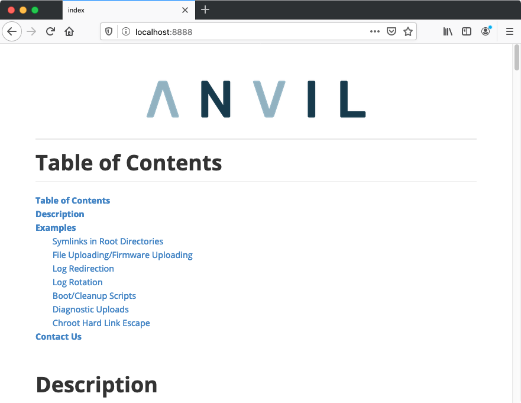

## Defeating Secure Boot with Symlink (& Hard Link) Attacks

This project is a virtual machine created to demonstrate the various attacks detailed in Anvil's [Defeating Secure Boot with Symlink and Hard Link Attacks]() white paper.

A typical Linux embedded system with secure boot cryptographically verifies the boot loader, kernel, and root file system. This can have the effect of making the root file system read only. This presents the embedded developer with a problem. Where then can an embedded developer store device-specific data such as configurations and logs between reboots? A common solution is to create an unprotected storage partition for non-volatile data (data that can be retrieved after power cycling) and mount it in a location such as /storage. Ideally, the non-volatile storage partition should be protected with cryptographic integrity checks, but from our experience, this is rarely done.

This virtual machine demonstrates how to attack systems configured with a split file system, a protected root file system, and a non-protected /storage partition.

### Running

1. Download the latest release.

2. Install [QEMU](https://www.qemu.org) and ensure `qemu-system-x86_64` is in your path.

3. Start the virtual machine

   ```sh
   > cd symlink-secure-boot-vm
   > ./start-qemu.sh serial-only
   ```

The virtual machine utilizes QEMU's user networking and forwards two ports, 8888 and 2121. The 8888 port runs a web server hosting services demonstrating the issues and can be reached at http://localhost:8888. The 2121 port is forwarded to an FTP service. Due to using QEMU's user networking to access the FTP service you need to use your interface's IP address and FTP active mode. Or modify the script to use Tap networking.

Browse to http://localhost:8888 to get started!



### Building

We used Buildroot's br2_external feature to construct the virtual machine.

1. Download [Buildroot](https://buildroot.org/download.html) (we used buildroot-2020.02.3)
2. Download/clone source.
3. Build using Buildroot's external  

```sh
> cd buildroot
> make BR2_EXTERNAL=../symlink-secure-boot-vm anvil_symlink-qemu_defconfig
> make
> ./output/images/start-qemu.sh serial-only
```

